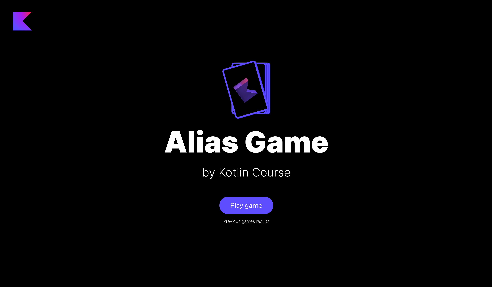

### Задание

Пора оживить карточки. Пакет `jetbrains.kotlin.course.alias.card` уже содержит обычный класс `CardService`. Вам нужно добавить несколько свойств и реализовать несколько методов:

- Добавьте свойство `identifierFactory` с типом `IdentifierFactory` для генерации идентификаторов для каждой карты. Не забудьте добавить значение по умолчанию (создайте новый экземпляр класса `IdentifierFactory`).
- Добавьте свойство `cards`, которое хранит список карт (`List<Card>`), его необходимо инициализировать методом `generateCards`.
- Добавьте объект-компаньон в класс `CardService` и объявите в нем константу `WORDS_IN_CARD` для хранения количества слов для карт. Ему нужно присвоить значение `4`. Также объявите здесь `cardsAmount`, который хранит возможное количество карт: `words.size / WORDS_IN_CARD`. В проекте содержится предопределенный список слов `words`.
- Реализуйте функцию `toWords` из класса `CardService`, это расширяющая функция для `List<String>`, которая конвертирует каждый элемент этого списка в `Word`.
- Реализуйте функцию `generateCards`, которая перемешивает список `words`, разбивает его на части по `WORDS_IN_CARD` слов каждую, берет `cardsAmount` частей для `cardsAmount` карт и, наконец, создает новую `Card` для каждой части.
- Реализуйте метод `getCardByIndex`, который принимает `index` (целое число) и возвращает `Card` на этом индексе. Лучше выбросить ошибку, если карта не существует, чтобы объяснить пользователю, что произошло.

После завершения этого задания вы сможете играть в игру:



Если у вас возникли трудности, **подсказки помогут вам решить это задание**.

----

### Подсказки

<div class="hint" title="Кликните здесь, чтобы узнать, как выглядит список слов">

В проекте содержится предопределенный список слов `words`. Это просто набор возможных слов, которые используются в игре:
```kotlin
val words = setOf(
    "кабель",
    "кривая",
    "вещество",
    ...
)
```
</div>

<div class="hint" title="Кликните здесь, чтобы узнать о встроенной функции `shuffled`">

Иногда нужно случайным образом перемешать содержимое списка; например, чтобы изменить порядок слов в оригинальном списке. Для этого можно либо сгенерировать различные позиции слов из оригинального списка и создать новый список, либо использовать встроенную функцию [`shuffled`](https://kotlinlang.org/api/latest/jvm/stdlib/kotlin.collections/shuffled.html):

  ```kotlin
  val numbers = listOf(1, 2, 3, 4, 5, 6)
  println(numbers.shuffled()) // 1, 2, 3, 4, 5, 6 в случайном порядке
  ```
</div>

<div class="hint" title="Кликните здесь, чтобы узнать о встроенной функции `chunked`">

Иногда нужно разделить список на `N` подсписков одинаковой длины; например, когда вы хотите разделить большой список слов на подсписки для каждой игровой карточки. Для этого можно вручную проходить по каждому `N` элементам и создавать новый подсписок, но также можно использовать встроенную функцию [`chunked`](https://kotlinlang.org/docs/collection-parts.html#chunked):

  ```kotlin
  val numbers = listOf(1, 2, 3, 4, 5, 6)
  println(numbers.chunked(2)) // [[1, 2], [3, 4], [5, 6]]
  ```
</div>

<div class="hint" title="Кликните здесь, чтобы узнать о встроенной функции `take`">

Иногда нужно взять из списка первые `N` элементов. Для этого можно либо проходить до `N`-го элемента и создавать новый список, либо использовать встроенную функцию [`take`](https://kotlinlang.org/api/latest/jvm/stdlib/kotlin.collections/take.html).

  ```kotlin
  val numbers = listOf(1, 2, 3, 4, 5, 6)
  println(numbers.take(4)) // [1, 2, 3, 4]
  ```
</div>

<div class="hint" title="Кликните здесь, чтобы узнать, как можно связать несколько вызовов функций">

В Kotlin нет необходимости создавать новую переменную для каждого вызова функции, если вы работаете с коллекциями, такими как списки. Вы можете вызывать их последовательно, создавая цепочку вызовов:

  ```kotlin
  val numbers = listOf(1, 2, 3, 4, 5, 6)
  val chunkedList = numbers.chunked(2)
  println(chunkedList.take(2)) // [[1, 2], [3, 4]]
  ```

Это **то же самое**, что и

  ```kotlin
  val numbers = listOf(1, 2, 3, 4, 5, 6)
  println(numbers.chunked(2).take(2)) // [[1, 2], [3, 4]]
  ```
</div>

<div class="hint" title="Кликните здесь, чтобы узнать о встроенных функциях `map` и `forEach`">

Если вам нужно обработать каждый элемент в коллекции, такой как список или карта, вы можете использовать встроенные функции `forEach` или `map` вместо цикла `for`. В этом случае действия пишутся в фигурных скобках.

Главное отличие между `forEach` и `map` – это возвращаемое значение. Если вы используете функцию `map`, вы **получите** новую коллекцию, например, список с преобразованными значениями, и можно продолжить цепочку вызовов. Если использовать функцию `forEach`, вы **не получите** новую коллекцию:

```kotlin
val numbers = listOf(1, 2, 3, 4, 5, 6)
for (number in numbers) {
  println(number)
}
```
Это **то же самое**, что и:
```kotlin
val numbers = listOf(1, 2, 3, 4, 5, 6)
numbers.forEach { println(it) }
```

Однако если вы используете функцию `map`, поведение будет другим:
```kotlin
val numbers = listOf(1, 2, 3, 4, 5, 6)
val squared = numbers.map { 
  println(it)
  it * it
} // [1, 4, 9, 16, 25, 36]
```

Во втором случае вначале будет напечатан исходный список `[1, 2, 3, 4]`, а затем каждый элемент этого списка будет возведен в квадрат. Результат последнего действия в фигурных скобках войдет в итоговый список.

Вы также можете комбинировать `map` с другими функциями:
```kotlin
val numbers = listOf(1, 2, 3, 4, 5, 6)
println(numbers.take(3).map { it * it }) // [1, 4, 9]
```
</div>

<div class="hint" title="Кликните здесь, чтобы узнать о встроенной функции `getOrNull`">

Если вы пытаетесь получить элемент из списка по несуществующему индексу, произойдет ошибка. Чтобы этого избежать, можно использовать встроенную функцию [`getOrNull`](https://kotlinlang.org/api/latest/jvm/stdlib/kotlin.collections/get-or-null.html), которая вернет значение или `null`, если индекс не существует:

  ```kotlin
  val numbers = listOf(1, 2, 3, 4)
  println(numbers[10]) // Возбуждает ошибку выхода за пределы индекса

  println(numbers.getOrNull(10) ?: error("Вы используете некорректный индекс 10 для списка")) // Это лучше, так как сообщение об ошибке предоставит пользователю детальную информацию
  ```
</div>