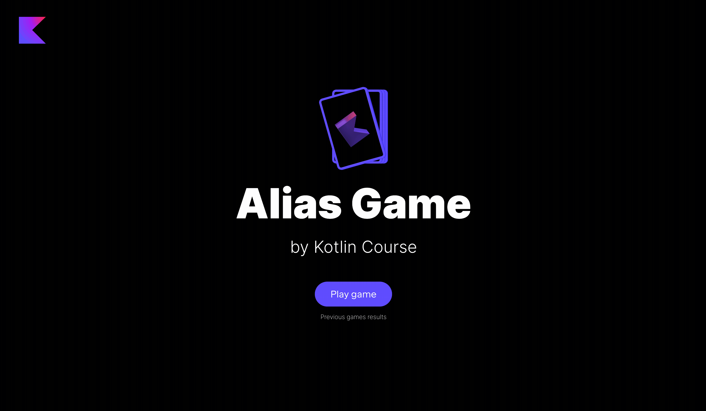

Поздравляем! Ваша игра почти готова – осталось лишь добавить отображение таблицы лидеров в конце игры
и сохранять результаты предыдущих раундов.
В этом задании вы реализуете несколько моментов в уже определенном классе `GameResultsService` в пакете `jetbrains.kotlin.course.alias.results`:

- добавьте псевдоним типа `GameResult` для `List<Team>`;
- добавьте объект-компаньон в `GameResultsService`
  и объявите переменную `gameHistory` для хранения списка результатов игр (`MutableList<GameResult>`).
  По умолчанию она должна быть инициализирована через пустой список.
- реализуйте метод `saveGameResults`, который добавляет `result` в `gameHistory`.
  Перед добавлением `result` вам необходимо проверить два условия и выбросить ошибку, если они нарушены: 1) `result` не должен
  быть пустым; 2) все идентификаторы команд из `result` должны быть в `TeamService.teamsStorage`.
- реализуйте метод `getAllGameResults`, который возвращает развернутый список `gameHistory`.

<div class="hint" title="Нажмите здесь, если вы нашли ошибку компиляции">

  Если у вас есть ошибка компиляции и вы еще не решили этот шаг, пожалуйста, выполните задание и попробуйте еще раз.
  Это ожидаемое поведение, так как код требует псевдоним типа `GameResult`, но он не существует.
</div>

Ура! После завершения этого шага игра будет работать хорошо:



<div class="hint" title="Нажмите здесь, чтобы узнать о возможных способах расширения проекта">

Поздравляем! Вы проделали отличную работу и создали работающее приложение.
Мы собрали несколько идей, как вы можете дальнейше улучшать этот проект самостоятельно.
Эти улучшения не будут проверяться в рамках курса.
Некоторые улучшения требуют изменений как на стороне клиента (что отображается в браузере),
так и на стороне сервера (логика приложения).
Мы не охватываем архитектуру клиент-сервер в этом курсе,
поэтому вы можете либо изучить это самостоятельно, либо реализовать идеи, которые не требуют изучения стороннего кода.

**Улучшения сервера:**

- В настоящее время приложение выдает ошибку, если что-то пошло не так:
  например, приложение выдает ошибку, если список с словами для новых карточек станет пустым.
  В качестве улучшения вы можете добавить обработку этого рода ошибок.
- Вы можете добавить категории для слов на карточке, такие как животные,
  страны или фильмы, чтобы сделать процесс игры более разнообразным.
  В начале игры вы можете генерать случайную категорию в качестве стандартного варианта.
- В настоящее время мы теряем прогресс игры, если выключаем сервер.
  Вы можете реализовать возможность сохранения текущего состояния игры в файлы,
  и при запуске сервера можете извлечь эти данные.

**Улучшения клиента:**

- Обработку ошибок можно добавить не только на сервер, но и на клиентскую сторону:
  например, вы можете показать диалоговое окно с сообщением об ошибке.
- Категории слов можно добавить не только на сервер, но и на клиентскую сторону:
  например, вы можете добавить новый экран для выбора категории.
- Вы можете добавить список запретных слов, которые не могут использоваться при описании слова на карточке.
  Для этого улучшения на стороне клиента необходимо отображать такой список слов.
</div>

Если у вас возникли трудности, **подсказки помогут вам решить это задание**.

----

### Подсказки

<div class="hint" title="Нажмите здесь, чтобы узнать о встроенной функции `isNotEmpty`">

Если вам нужно проверить, что список не пустой, вы можете проверить его размер или использовать встроенную функцию [isNotEmpty](https://kotlinlang.org/api/latest/jvm/stdlib/kotlin.collections/is-not-empty.html):

  ```kotlin
  val numbers = listOf(1, 2, 3)
  if (numbers.size != 0) {
      TODO()
  }
  ```
Это то же **самое**, что

  ```kotlin
  val numbers = listOf(1, 2, 3)
  if (numbers.isNotEmpty()) {
      TODO()
  }
  ```
</div>

<div class="hint" title="Нажмите здесь, чтобы узнать о `contains` и `in`">

В Kotlin вы можете использовать [операторы](https://kotlinlang.org/docs/java-interop.html#operators) вместо нескольких функций, чтобы сделать код короче.
Например, вместо функции `contains` вы можете использовать оператор `in`, чтобы проверить, содержит ли коллекция определенный элемент:

  ```kotlin
  val numbers = listOf(1, 2, 3, 4)
  println(numbers.contains(1)) // true
  ```
Это то же **самое**, что
  ```kotlin
  val numbers = listOf(1, 2, 3, 4)
  println(1 in numbers) // true
  ```
</div>

<div class="hint" title="Нажмите здесь, чтобы узнать о встроенной функции `all`">

Если вам нужно проверить, что **все** элементы удовлетворяют заданному предикату, вы можете использовать встроенную функцию [`all`](https://kotlinlang.org/api/latest/jvm/stdlib/kotlin.collections/all.html).
Вам нужно поместить предикат в фигурные скобки:

  ```kotlin
  val evenNumbers = listOf(2, 4, 6)
  println(evenNumbers.all { it % 2 == 0 }) // true
  println(evenNumbers.all { it == 4 }) // false, потому что только один элемент удовлетворяет предикату
  ```
</div>

<div class="hint" title="Нажмите здесь, чтобы узнать о встроенной функции `reversed`">

Если вам нужно получить список, в котором элементы расположены в обратном порядке,
вы можете либо пройтись по элементам исходного списка с конца к началу и вернуть новый список, либо использовать встроенную функцию [`reversed`](https://kotlinlang.org/api/latest/jvm/stdlib/kotlin.collections/reversed.html):

  ```kotlin
  val numbers = listOf(1, 2, 3, 4)
  val reversedList = mutableListOf<Int>()
  for (i in numbers.size - 1 downTo 0) {
    reversedList.add(numbers[i])
  }
  println(reversedList) // [4, 3, 2, 1]
  ```

Это то же **самое**, что
  ```kotlin
  val numbers = listOf(1, 2, 3, 4)
  val reversedList = numbers.reversed()
  println(reversedList) // [4, 3, 2, 1]
  ```
</div>