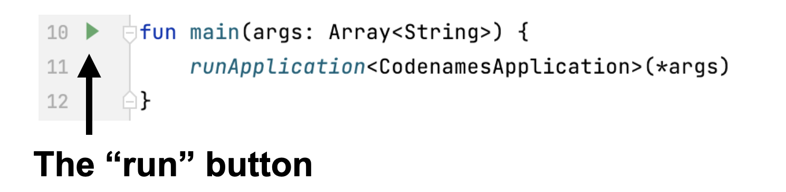
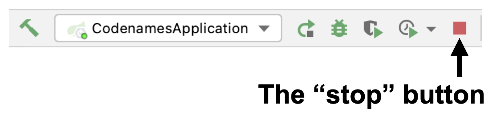
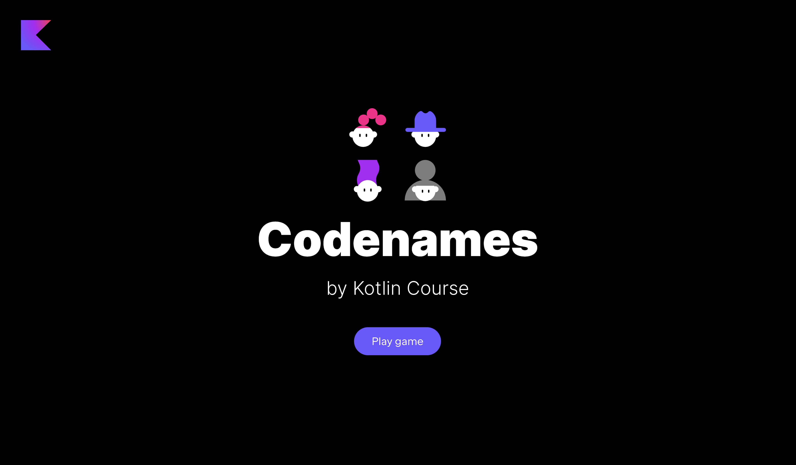

На каждом этапе вы можете запустить текущую версию игры. Однако, если какая-то функциональность еще не готова, то некоторые кнопки могут не работать, и некоторая информация может не отображаться.

Чтобы запустить приложение, вам нужно запустить функцию `main` в файле [CodenamesApplication.kt](./src/main/kotlin/jetbrains/kotlin/course/codenames/CodenamesApplication.kt):

Пожалуйста, не забудьте _остановить все остальные запуски_, нажав на кнопку с красным квадратом:

Затем вам нужно открыть любой браузер (мы рекомендуем использовать [Google Chrome](https://www.google.com/chrome/) для отображения элементов, как в примерах) и открыть http://localhost:8080/. Вы увидите главную страницу приложения.

Если при запуске игры на экране отображается игра из предыдущего запуска, необходимо сбросить кэш. Обычно это можно сделать с помощью сочетания клавиш: `ctrl` + `shift` + `R` (`command` + `shift` + `R` для macOS).

