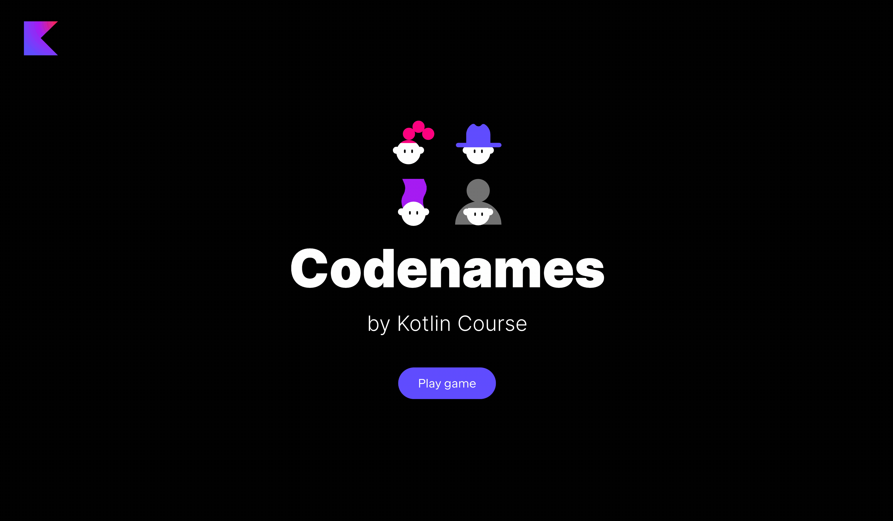

### Описание проекта

Проект этого урока — **Кодовые имена**.
Скорее всего, все знают эту настольную игру для вечеринок.
В этой игре игроки разделяются на две команды.
Каждая команда выбирает лидера 
и пытается угадать все слова своего цвета, совершив меньше попыток, чем другая команда.

Вы можете ознакомиться с подробными правилами в [Википедии](https://en.wikipedia.org/wiki/Codenames_(board_game)).

### Темы урока

- объекты;
- блоки инициализации;
- перечисления (enum);
- функциональные интерфейсы (один абстрактный метод, SAM);
- интерфейсы и наследование;
- некоторые встроенные функции для обработки ошибок и работы с коллекциями.

### Пример проекта

К концу этого задания вы создадите следующую игру:

