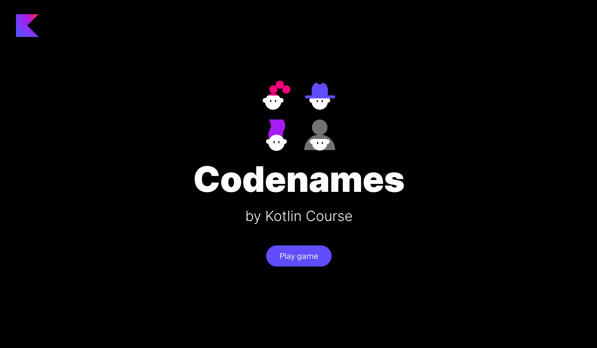

Пакет `jetbrains.kotlin.course.codenames.keyCard` уже содержит обычный класс `KeyCardService`. Он отвечает за игровую логику для ключевой карты. В этой задаче вам нужно реализовать функцию `generateKeyCard`, чтобы оживить игру:

- Реализуйте функцию `generateKeyCard`, которая возвращает новый экземпляр класса `KeyCard`.

После выполнения этой задачи вы сможете увидеть сгенерированную `KeyCard`, но игровое поле еще не будет сгенерировано:

Если у вас возникнут трудности, **подсказки помогут вам решить эту задачу**.

----

### Подсказки

Вам просто нужно создать новый экземпляр класса `KeyCard`: `KeyCard()`. Так как он уже имеет значение по умолчанию для поля `cells`, вы можете не передавать аргументы.

