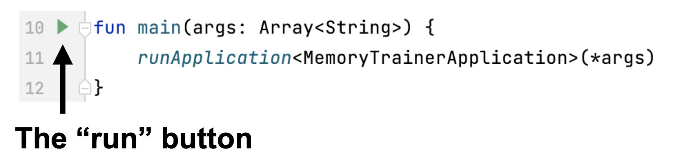
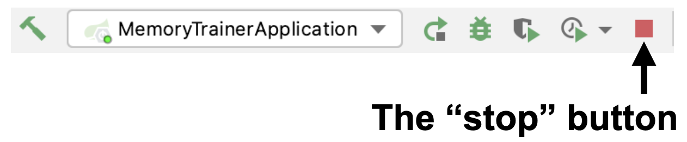
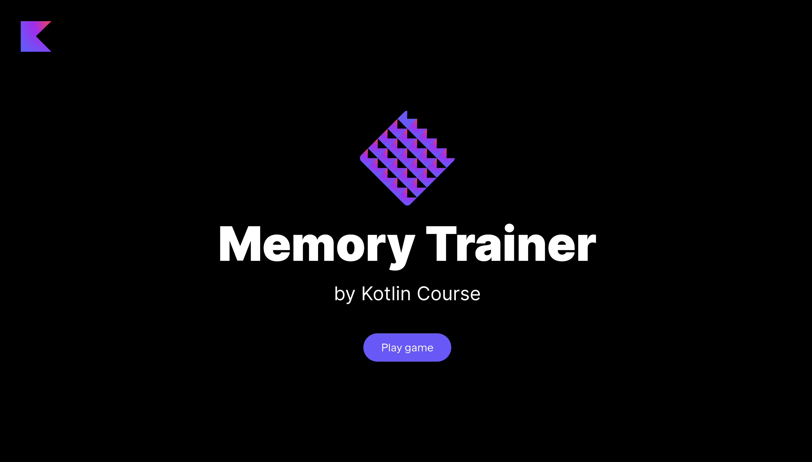

На каждом этапе вы можете запустить текущую версию приложения. 
Однако, если какая-то функциональность еще не была реализована, 
некоторые кнопки могут не работать, а часть информации может не отображаться.

Для запуска приложения необходимо выполнить функцию `main` внутри 
файла [MemoryTrainerApplication.kt](./src/main/kotlin/jetbrains/kotlin/course/card/trainer/MemoryTrainerApplication.kt):

Пожалуйста, не забудьте _остановить все другие запуски_, нажав на квадратную красную кнопку:

Далее вам нужно открыть любой браузер (рекомендуем использовать [Google Chrome](https://www.google.com/chrome/), чтобы элементы отображались как в примерах) 
и открыть http://localhost:8080/. Вы увидите главную страницу приложения.

Если при запуске игры на экране отображается игра из предыдущего запуска, вам нужно очистить кэши.
Это обычно можно сделать с помощью комбинации клавиш: `ctrl` + `shift` + `R` (`command` + `shift` + `R` для macOS).

