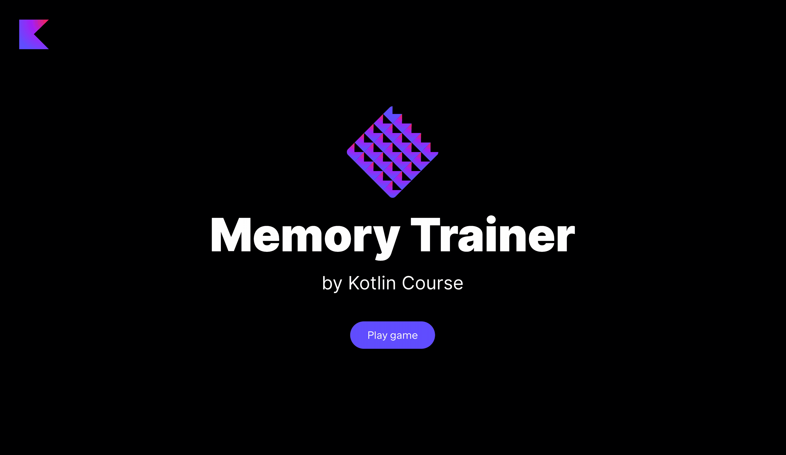

Этот урок посвящен темам, рассмотренным в предыдущем уроке. Главное отличие в том, что этот урок не содержит теоретической части — вам просто нужно самостоятельно реализовать проект с нуля. Мы не сомневаемся, что у вас всё получится!

----

### Описание проекта

Проект этого урока — **Тренер памяти**. Это приложение позволит вам тренировать память и запоминать страны и их столицы.

### Пример проекта

В конце этого задания вы создадите следующее приложение:

