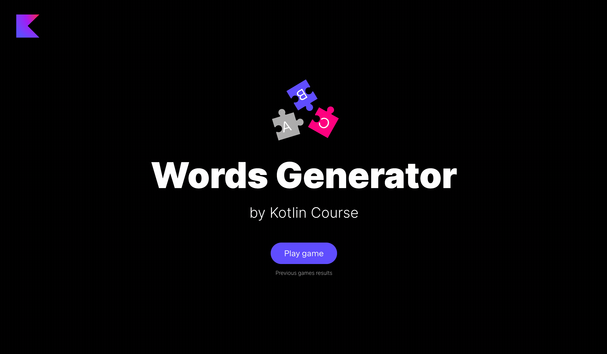

Поздравляю! Ваша игра почти готова, осталось только добавить отображение таблицы лидеров для текущей игры и для предыдущих раундов.

В этом задании вам нужно реализовать несколько вещей в уже определенном классе `GameResultsService` в пакете `jetbrains.kotlin.course.words.generator.results`. Обратите внимание, что этот класс тот же, что и `GameResultsService` из игры Alias, поэтому вы можете либо попрактиковаться снова, либо просто скопировать предыдущее решение.

- Добавьте псевдоним типа `GameResult` для `List<Team>`.
- Добавьте объект-компаньон в `GameResultsService` и объявите переменную `gameHistory` для хранения списка игровых результатов (`MutableList<GameResult>`). По умолчанию она должна быть инициализирована пустым списком.
- Реализуйте метод `saveGameResults`, который добавляет `result` в `gameHistory`. Перед добавлением `result`, нужно проверить два условия и выбросить ошибку, если они нарушены: 1) `result` не должен быть пустым; 2) во всех `result` должен присутствовать Id команды из `TeamService.teamsStorage`.
- Реализуйте метод `getAllGameResults`, который возвращает перевернутый список `gameHistory`. Его тип возврата должен быть явно указан.

<div class="hint" title="Нажмите здесь, если вы нажали 'Проверить' и обнаружили ошибку компиляции">

Если у вас ошибка компиляции и вы еще не решили этот шаг, пожалуйста, выполните задачу и попробуйте снова. Это ожидаемое поведение, поскольку код требует псевдоним типа `GameResult`, но он не существует.
</div>

Ура! После выполнения этого шага игра будет работать нормально:



<div class="hint" title="Нажмите здесь, чтобы узнать о возможных способах расширения проекта">

Поздравляем! Вы сделали отличную работу и создали работающее приложение. Мы собрали несколько идей о том, как вы можете улучшить этот проект самостоятельно. Эти улучшения не будут протестированы в рамках курса. Некоторые улучшения требуют изменений как на стороне клиента (что отображается в браузере), так и на стороне сервера (логика приложения). Мы не освещаем архитектуру клиент-сервер в этом курсе, так что можете либо изучить это сами, либо реализовать идеи, не требующие погружения в сторонний код.

**Улучшения на серверной стороне:**

- Начисляйте бонусные очки командам, придумывающим слова, которые длиннее определенного количества букв или используют все буквы оригинального слова. Или можете просто назначать очки каждому слову в зависимости от количества букв или сложности слова. Сейчас очки рассчитываются на стороне клиента, так что, чтобы учесть бонусные очки, нужно не только реализовать правила, но и правильно сохранять очки после каждого раунда.
- Выберите слово из иностранного языка и предложите командам придумать английские слова, использующие те же буквы.
- В данный момент приложение выдает ошибку, если что-то идет не так: например, приложение выдает ошибку, если список со словами для новых раундов становится пустым. Как улучшение, можно добавить обработку такого рода ошибок.
- Ограничьте количество раз, которое каждая команда может использовать каждую букву оригинального слова.
- В данный момент мы теряем прогресс игры, если выключаем сервер. Можете реализовать возможность сохранять текущее состояние игры в файлах, и при запуске сервера эти данные могут быть извлечены.

**Улучшения на клиентской стороне:**

- Показывайте бонусные очки пользователю в течение игрового раунда.
- Вы можете создать новый экран, чтобы предоставить пользователю возможность выбора языка для слов.
- Обработка ошибок может быть добавлена не только на сервер, но и на стороне клиента: например, вы можете показывать диалоговое окно с сообщением об ошибке.
</div>

Если у вас возникли трудности, **подсказки помогут вам решить эту задачу**.

----

### Подсказки

<div class="hint" title="Нажмите, чтобы узнать о встроенной функции `isNotEmpty`">

Если вам нужно проверить, является ли список пустым или нет, вы можете либо проверить его размер, либо использовать встроенную функцию [`isNotEmpty`](https://kotlinlang.org/api/latest/jvm/stdlib/kotlin.collections/is-not-empty.html):

```kotlin
val numbers = listOf(1, 2, 3)
if (numbers.size != 0) {
    TODO()
}
```
Это **то же самое**, что и

```kotlin
val numbers = listOf(1, 2, 3)
if (numbers.isNotEmpty()) {
    TODO()
}
```
</div>

<div class="hint" title="Нажмите, чтобы узнать о встроенной функции `reversed`">

Если вам нужно получить список, в котором элементы идут в обратном порядке, вы можете либо пройтись по элементам исходного списка с конца до начала и вернуть новый список, либо использовать встроенную функцию [`reversed`](https://kotlinlang.org/api/latest/jvm/stdlib/kotlin.collections/reversed.html):

```kotlin
val numbers = listOf(1, 2, 3, 4)
val reversedList = mutableListOf<Int>()
for (i in numbers.size - 1 downTo 0) {
  reversedList.add(numbers[i])
}
println(reversedList) // [4, 3, 2, 1]
```

Это **то же самое**, что и
```kotlin
val numbers = listOf(1, 2, 3, 4)
val reversedList = numbers.reversed()
println(reversedList) // [4, 3, 2, 1]
```
</div>