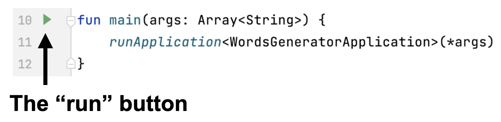
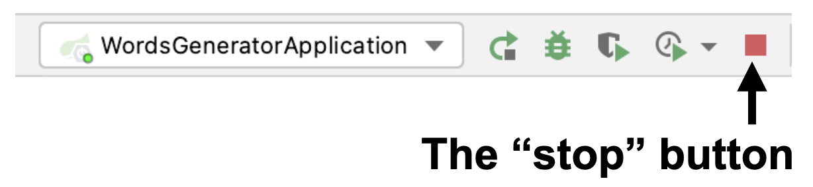
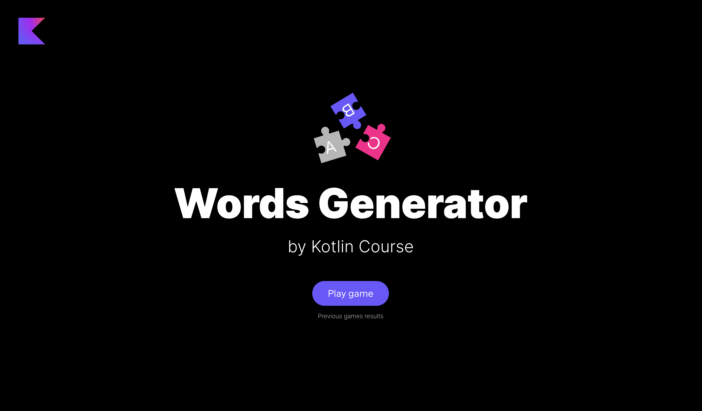

На каждом этапе вы можете запустить текущую версию игры. Однако, если какая-то функциональность еще не готова, некоторые кнопки могут не работать, а часть информации может не отображаться.

Чтобы запустить приложение, необходимо выполнить функцию `main` внутри файла [WordsGeneratorApplication.kt](./src/main/kotlin/jetbrains/kotlin/course/words/generator/WordsGeneratorApplication.kt):

Пожалуйста, не забудьте _остановить все остальные запуски_, нажав на красную квадратную кнопку:

Далее нужно открыть любой браузер (рекомендуем использовать [Google Chrome](https://www.google.com/chrome/), чтобы элементы отображались как на примерах) и открыть http://localhost:8080/. Вы увидите главную страницу приложения.

Если при запуске игры на экране отображается игра из предыдущего запуска, нужно сбросить кэш. Обычно это можно сделать с помощью сочетания клавиш: `ctrl` + `shift` + `R` (`command` + `shift` + `R` для macOS).

