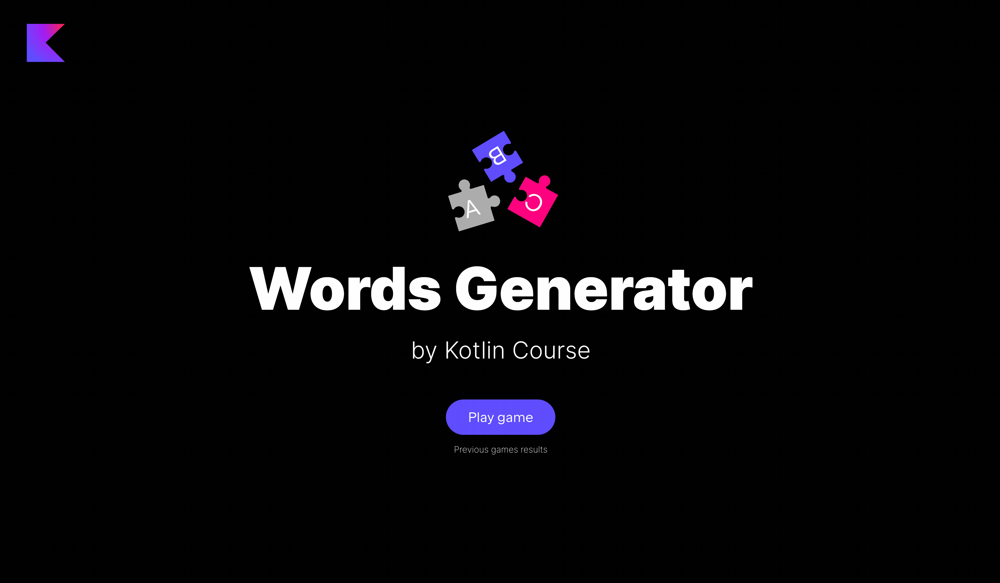

**Цель** этого шага — добавить валидаторы в класс `WordService`.

Найдите уже добавленный класс `WordService` в пакете `jetbrains.kotlin.course.words.generator.word` и измените его.

- Реализуйте функцию `isValidWord`, которая проверяет, может ли полученное слово быть построено из длинного слова:

  - Если `newWord` (введенное пользователем слово) _пусто_, верните `false`.
  - Если `newWord` содержит символы, отсутствующие в `keyWord`, верните `false`.
  - Обратите внимание, количество раз, которое какой-либо символ встречается в `newWord`, не может быть больше
    чем количество раз, которое этот символ встречается в `keyWord`.
  ```kotlin
  val a = service.isValidWord("photothermoelasticity", "") // false
  val b = service.isValidWord("photothermoelasticity", "dog") // false
  val c = service.isValidWord("photothermoelasticity", "photo") // true
  val d = service.isValidWord("photothermoelasticity", "photooooo") // false потому что изначальное слово содержит только два символа <o>
  val e = service.isValidWord("photothermoelasticity", "pilot") // true
  ```

- Добавьте внутреннюю переменную `previousWords` в объект-компаньон в этом классе с типом `MutableMap<String, MutableList<Word>>`,
  которая связывает каждое игровое слово со списком уже угаданных слов. Не забудьте инициализировать эту карту как пустую карту.
- Реализуйте функцию `isNewWord`:

  - Если `previousWords` пока не содержат `keyWord`, добавьте `keyWord` в карту `previousWords` вместе с `newWord` и верните `true`.
  - Если список слов `previousWords[keyWord]` содержит `newWord`, верните `false`; иначе добавьте `newWord` в карту и верните `true`.


После решения этого шага игра будет практически завершенной:



Если у вас возникнут трудности, **подсказки помогут решить эту задачу**.

----

### Подсказки

<div class="hint" title="Нажмите, чтобы узнать о встроенной функции `isEmpty`">

Вы также можете использовать функцию `isEmpty` со строками, а не только с списками:

  ```kotlin
  fun main() {
    println("".isEmpty()) // true
    println("cat".isEmpty()) // false
  }
  ```
</div>

<div class="hint" title="Нажмите, чтобы узнать о встроенных функциях агрегации">

Kotlin имеет множество встроенных функций для агрегации; рассмотрите некоторые из них, которые могут помочь вам решить эту задачу.
Вы можете использовать [`groupingBy`](https://kotlinlang.org/api/latest/jvm/stdlib/kotlin.collections/grouping-by.html), чтобы сгруппировать слово по его буквам,
а затем использовать [`eachCount`](https://kotlinlang.org/api/latest/jvm/stdlib/kotlin.collections/each-count.html), чтобы подсчитать количество вхождений каждой буквы:

  ```kotlin
  fun main() {
    val word = "photothermoelasticity"
    val grouped = word.groupingBy { it }.eachCount() // возвращает карту
    println(grouped) // {p=1, h=2, o=3, t=4, e=2, r=1, m=1, l=1, a=1, s=1, i=2, c=1, y=1}
  }
  ```

Эти функции работают со специальным представлением [Grouping](https://kotlinlang.org/api/latest/jvm/stdlib/kotlin.collections/-grouping/), которое мы рассмотрим подробнее в третьем модуле этого курса.
</div>

<div class="hint" title="Нажмите, чтобы узнать о встроенной функции `all`">

Если вам нужна проверка, что **все** элементы соответствуют данному предикату, вы можете использовать встроенную функцию [`all`](https://kotlinlang.org/api/latest/jvm/stdlib/kotlin.collections/all.html).
Вам нужно заключить предикат в фигурные скобки:

  ```kotlin
  val evenNumbers = listOf(2, 4, 6)
  println(evenNumbers.all { it % 2 == 0 }) // true
  println(evenNumbers.all { it == 4 }) // false потому что только один элемент удовлетворяет предикату
  ```
</div>

<div class="hint" title="Нажмите, чтобы узнать о встроенной функции `putIfAbsent`">

При работе с картой, вы можете использовать встроенную функцию `putIfAbsent` для добавления нового значения, если оно отсутствует в карте:
  ```kotlin
  val myMap = mutableMapOf<Int, String>()
  if (1 !in myMap.keys) {
      myMap[1] = "one"
  }
  ```
Это то же самое, что и:
  ```kotlin
  val myMap = mutableMapOf<Int, String>()
  myMap.putIfAbsent(1, "one")
  ```
</div>

<div class="hint" title="Нажмите, чтобы узнать о `contains` и `in`">

В Kotlin вы можете использовать [операторы](https://kotlinlang.org/docs/java-interop.html#operators) вместо определенных функций, чтобы сделать код короче.
Например, вместо использования функции `contains`, вы можете использовать оператор `in`, чтобы проверить, содержит ли коллекция определенный элемент:

  ```kotlin
  val numbers = listOf(1, 2, 3, 4)
  println(numbers.contains(1)) // true
  ```
Это то же самое, что и
  ```kotlin
  val numbers = listOf(1, 2, 3, 4)
  println(1 in numbers) // true
  ```
</div>